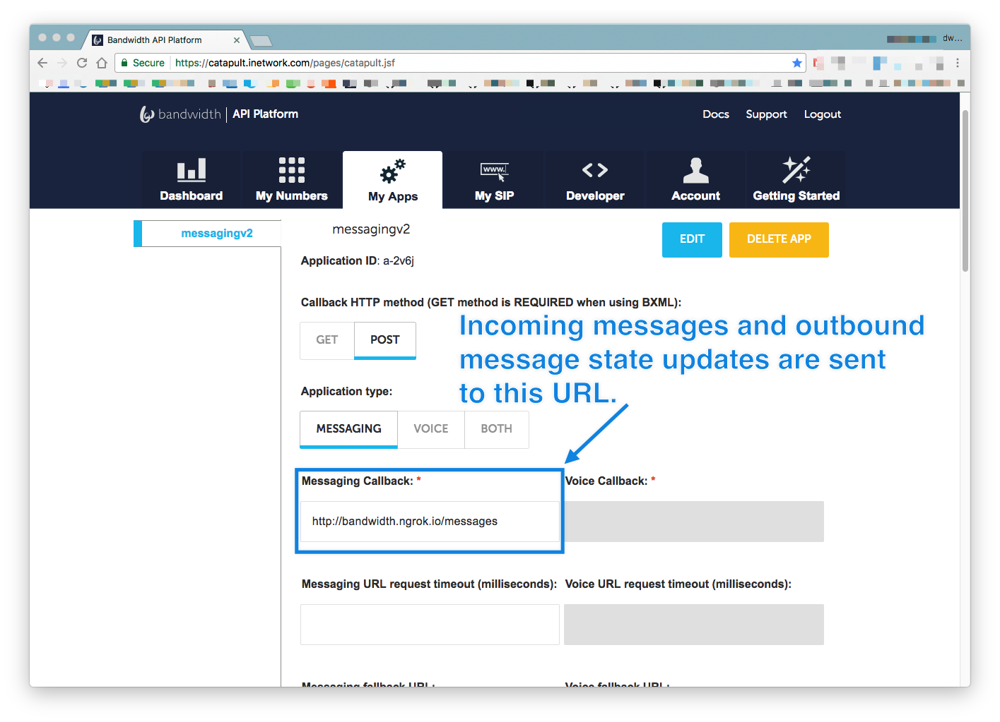

# Setup The Bandwidth Application

In order to recieve delivery notifications and message state, each phone number needs to be assigned to a [Bandwidth Application](http://dev.bandwidth.com/ap-docs/methods/applications/applications.html).

> Follow the [tutorial](http://dev.bandwidth.com/howto/incomingCallandMessaging.html) on how to create an application and order phone numbers

### Enable the application for v2-messaging

You *MUST* update each individual `application` to use v2-messaging.  This can _ONLY_ be done via a <code class="post">POST</code> request to the `/applications` endpoint.

#### Update an existing Application

Updating an existing application will enable *ALL* phonenumbers associated that appication for v2-messaging.

Create a <code class="post">POST</code> request to the `applicationId` endpoint to with `{"messageApiVersion" : "V2"}`.

```http
POST https://api.catapult.inetwork.com/v1/users/{userId}/applications/{applicationId} HTTP/1.1
Content-Type: application/json; charset=utf-8
Authorization: Basic dc123

{
	"messageApiVersion": "V2"
}

```

#### Create a new Application

You can also create a new application to use with v2-messaging.

<aside class="alert general small">
	You need to assign numbers to the new application to use for v2-messaging
</aside>

```http
POST https://api.catapult.inetwork.com/v1/users/{userId}/applications HTTP/1.1
Content-Type: application/json; charset=utf-8
Authorization: Basic dc123

{
	"name"              : "My Super Fast Messaging Service",
	"incomingMessageUrl": "http://your_site.co,m/messages",
	"messageApiVersion" : "V2"
}

```

## Validate callback Url
Make sure that the callback url is configured correctly for your application.

### Using the UI
Log into the Bandwidth service and navigate to the `My Apps` Tab.

Either find or create the application and validate the `Messaging Callback` value is configured correctly.




### Using the API

Check your application status by making a <code class="get">GET</code> request to your application id.

<code class="get">GET</code>`https://api.catapult.inetwork.com/v1/users/{userId}/applications/{applicationId}`

Incoming messages and outbound message states updates are sent to the url specified as the `incomingMessageUrl`

```bash
curl -v -X GET  https://api.catapult.inetwork.com/v1/users/{user-id}/applications/{applicationId}
  -u {token}:{secret} \
  -H "Content-type: application/json" \
 ```

```http
Status: 200 OK
Content-Type: application/json

 {
  "id": "{applicationId}",
  "name": "MyFirstApp",
  "incomingCallUrl": "http://example.com/calls.php",
  "incomingMessageUrl": "http://example.com/messages.php",
  "autoAnswer": true,
  "messageApiVersion": "V2"
}
```


