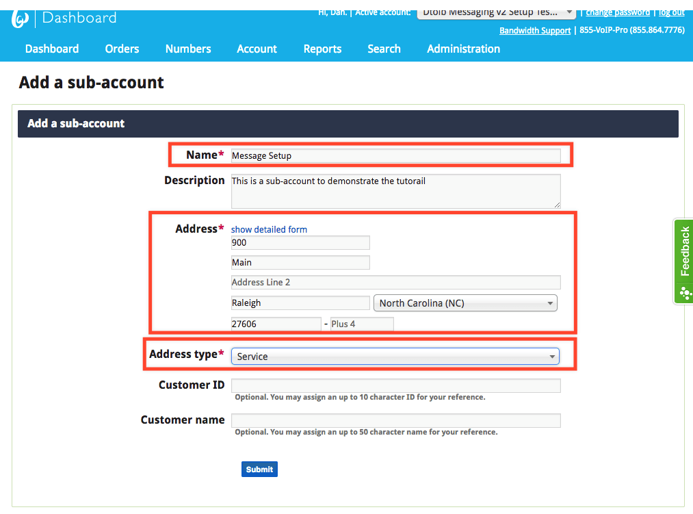

# Messaging 2.0 Account Setup (UI) {#top}

This walks through the steps to configure your Bandwidth Phone Number Dashboard and Messaging API to work together.
This guide is entirely focused on setup with the UI.  If you'd like to follow along with the API, head to the [via API](apisetup.md) to follow along there.

## Assumptions

* You have downloaded [Postman](https://www.getpostman.com/) -or- have the ability to make an API request.
* You have your [Voice and Messaging API](https://app.bandwidth.com) `userId`, `token`, `secret`
* You have your [Phone Number API](https://dashboard.bandwidth.com) `username` and `password`
* You have contacted [Support](http://support.bandwidth.com) to link your [Voice and Messaging API](https://app.bandwidth.com) and [Phone Number API](https://dashboard.bandwidth.com)

## Follow along with Postman

Fill out the form on the [Postman](postman.md) page to download the Messaging 2.0 collection.

## Steps

1. [Get your account ID](#get-your-account-id)
2. [Create your first Application](#setup-your-application)
3. [Create subaccount (_site_)](#create-subaccount-site)
4. [Create location (_sippeer_) and assign the application](#create-location-sippeer-and-assign-the-application)
5. [Order Phone numbers to location (_sippeer_)](#order-numbers-to-location)
6. [Sending Messages](#sending-messages)

## Get your account ID {#get-your-account-id}

1. Log into the [Bandwidth Phone Number Dashboard](https://dashboard.bandwidth.com)
2. Click the **Account** tab in the menu section to go to your **Account Overview**
3. Under the **Account overview** section you should see your account ID.


## Create your first Application {#setup-your-application}

ℹ️ Learn more about [Applications](applications/about.md) ℹ️

The Application contains the HTTP URL you want to use for both inbound and outbound messages.

<aside class="alert general small">
<p>
Save the <code>Application Id</code> After creating the application.
</p>
</aside>

#### Application Parameters



| Parameters               | Mandatory | Description                                                                         |
|:-------------------------|:----------|:------------------------------------------------------------------------------------|
| `AppName`                | Yes       | Plain text name of the application                                                  |
| `CallbackUrl`            | Yes       | Url to recieve _all_ [message events](./events/messageEvents.md)                    |
| `CallBackCreds`          | No        | Basic auth credentials to apply to your [message events](./events/messageEvents.md) |
| `CallBackCreds.UserId`   | No        | Basic auth `UserId`                                                                 |
| `CallBackCreds.Password` | No        | Basic auth `Password`                                                               |



### Create Application



```http
POST https://dashboard.bandwidth.com/api/accounts/{{accountId}}/applications HTTP/1.1
Content-Type: application/xml; charset=utf-8
Authorization: {user:password}

<Application>
    <AppName>Production Server</AppName>
    <CallbackUrl>https://yourSecureSite.com/callbacks</CallbackUrl>
    <CallbackCreds>
      <UserId>Your-User-id</UserId>
      <Password>Your-Password</Password>
  </CallbackCreds>
</Application>
```



### Response

```http
HTTP/1.1 201 Created
Content-Type: application/xml

<?xml version="1.0" encoding="UTF-8" standalone="yes"?>
<ApplicationProvisioningResponse>
    <Application>
        <ApplicationId>d775585a-ed5b-4a49-8b96-f68c0a993ebe</ApplicationId>
        <ServiceType>Messaging-V2</ServiceType>
        <AppName>Production Server</AppName>
        <CallbackUrl>https://yourSecureSite.com/callbacks</CallbackUrl>
        <CallbackCreds>
            <UserId>Your-User-id</UserId>
            <Password>Your-Password</Password>
        </CallbackCreds>
    </Application>
</ApplicationProvisioningResponse>
```



---

## Create sub-account (_site_) {#create-subaccount-site}

1. Navigate to the [**Add a sub-account**](https://dashboard.bandwidth.com/portal/report/#addsubaccount:) page (_if you already have a sub-account you'd like to use, you can skip this step_)
    * **Account** > **Configuration** > **Sub-accounts** > **Add a sub-account**

* You'll need a sub-account (_site_) in order to create a location (_sippeer_).
* Fill in the address and set the `type` to `Service`



---

## Create location (_sippeer_) and assign the application {#create-location-sippeer-and-assign-the-application}

1. Navigate to the [**Add a location**](https://dashboard.bandwidth.com/portal/report/#addlocation:) page
    * **Account** > **Configuration** > **Locations** > **Add a location**

* You'll need a location (_sippeer_) in order to group phone numbers.
* When creating the location be sure to check:
	* `SMS Enabled`
	* `Toll Free` (if available)
	* `Short Code` (if available)
	* `V2 Messaging`
	* `Application` - Select the application created above
* If you need `Toll Free` or `Short Code` support contact [support](http://support.bandwidth.com) to enable.

#### More Detail


---

## Order Phone numbers to location (_sippeer_) {#order-numbers-to-location}

1. Navigate to the [**Order New Numbers**](https://dashboard.bandwidth.com/beta/#/newnumber) page
    * **Orders** > **Order New Numbers**

* Once your application, sub-account (_site_), and location (_sippeer_) have been configured you're ready to start ordering phone numbers to use.
* Using the UI, search for a number and order it to the sub-account (_site_) and location (_sippeer_) created above.


---

## Sending Messages {#sending-messages}

ℹ️ Learn more about [Messages](methods/sendMessages.md) ℹ️

* To send a message, `POST` to the [`/messages` endpoint](methods/createSingle.md)
* In the V2 Messaging API, messages are sent asynchronously. Message validation will happen after the server returns `HTTP 202 - Created`. API clients should listen for [HTTP callback events](events/messageEvents.md) to track message state after the initial `POST` request.

#### Message Parameters



| Parameter       | Mandatory | Description                                                                                                |
|:----------------|:----------|:-----------------------------------------------------------------------------------------------------------|
| `from`          | Yes       | One of your telephone numbers the message should come from (must be in E.164 format, like `+19195551212`). |
| `to`            | Yes       | The phone number the message should be sent to (must be in E.164 format, like `+19195551212`).             |
| `text`          | Yes       | The contents of the text message (must be 2048 characters or less).                                        |
| `applicationId` | Yes       | The ID of the Application your `from` number is associated with in the Bandwidth Phone Number Dashboard.   |



### Send Text Message



```http
POST https://api.catapult.inetwork.com/v2/users/{{userId}}/messages HTTP/1.1
Content-Type: application/json; charset=utf-8
Authorization: {token:secret}

{
  "from"          : "{{your-bandwidth-number}}",
  "to"            : "{{yourTN}}",
  "text"          : "Good morning, this is a test message",
  "applicationId" : "{{your-application-id}}"
}
```



### Response

```http
HTTP/1.1 202
Content-Type: "application/json;charset=UTF-8"

{
    "id"            : "15047516192013g5tuga77zsa6jrp",
    "owner"         : "+19193529968",
    "applicationId" : "05851417-c78b-4636-81a2-014a54d8f119",
    "time"          : "2017-09-07T02:33:39.201Z",
    "direction"     : "out",
    "to"            : ["+19191231234"],
    "from"          : "+19193524444",
    "text"          : "Hi from Bandwidth!"
}
```


