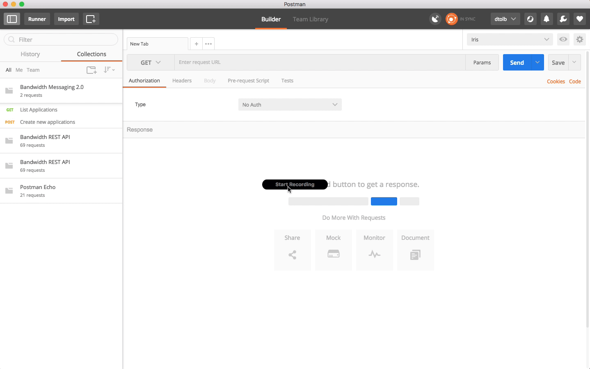
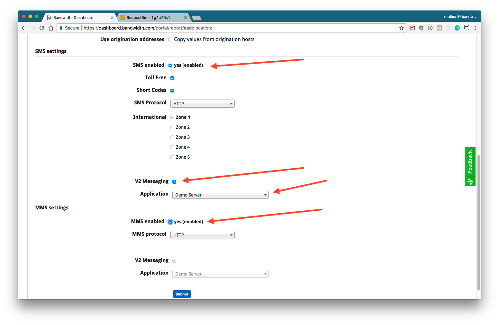

# Messaging 2.0 Account Setup (UI)

This walks through the steps to configure your Bandwidth Phone Number Dashboard and Messaging API to work together

## Steps

1. [Get your account ID](#get-your-account-id)
2. [Setup your Application](#setup-your-application)
3. [Create subaccount (_site_)](#create-subaccount-site)
4. [Create location (_sippeer_) and assign the application](#create-location-sippeer-and-assign-the-application)
5. [Order Phone numbers to location (_sippeer_)](#order-numbers-to-location)
6. [Sending Messages](#sending-messages)

### Get your account ID
<a name="get-your-account-id"></a>


### Setup your Application
<a name="setup-your-application"></a>

Hidden URL: https://dashboard.bandwidth.com/portal-v2/

The Application contains the HTTP URL you want to use for both inbound and outbound messages.

* To get started, you'll want to head over to the [Bandwidth Phone Number Dashboard](https://dashboard.bandwidth.com/portal/report/) and set up an Application on your Location (SipPeer) that you want to use for HTTP Messaging. You'll get an `applicationId` for the Application you created, which will be used when sending messages.



#### Application Parameters



| Parameters      | Mandatory | Description                                                                        |
|:----------------|:----------|:-----------------------------------------------------------------------------------|
| `AppName`       | Yes       | Plain text name of the application                                                 |
| `CallbackUrl`   | Yes       | Url to recieve _all_ [message events](./events/messageEvents.md)                    |
| `CallBackCreds` | No        | Basic auth credentials to apply to your [message events](./events/messageEvents.md) |



### Create Application



```http
POST https://dashboard.bandwidth.com/api/accounts/{{accountId}}/applications HTTP/1.1
Content-Type: application/xml; charset=utf-8
Authorization: {user:password}

<Application>
    <AppName>Demo Server</AppName>
    <CallbackUrl>https://requestb.in/zuaqjbzu</CallbackUrl>
    <CallbackCreds/>
</Application>
```



### Response

* Status: 201
* Content-Type: "application/xml"

```xml
<?xml version="1.0" encoding="UTF-8" standalone="yes"?>
<ApplicationProvisioningResponse>
    <Application>
        <ApplicationId>7cc3c4f7-3b8f-4fff-a211-45070792b431</ApplicationId>
        <ServiceType>Messaging-V2</ServiceType>
        <AppName>Demo Server</AppName>
        <CallbackUrl>https://requestb.in/1m009f61</CallbackUrl>
        <CallbackCreds/>
    </Application>
</ApplicationProvisioningResponse>
```



---

### Create subaccount (_site_)
<a name="create-subaccount-site"></a>

* You'll need a sub-account (_site_) in order to create a location (_sippeer_).
* Fill in the address and set the `type` to `Service`


---

### Create location (_sippeer_) and assign the application
<a name="create-location-sippeer-and-assign-the-application"></a>

* You'll need a location (_sippeer_) in order to group phone numbers.
* When creating the location be sure to check:
	* `SMS Enabled`
	* `Toll Free` (if available)
	* `Short Code` (if available)
	* `V2 Messaging`
	* `Application` - Select the application created above
* If you need `Toll Free` or `Short Code` support contact [support](http://support.bandwidth.com) to enable.


#### More Detail


---

### Order Phone numbers to location (_sippeer_)
<a name="order-numbers-to-location"></a>

* Once your application, sub-account (_site_), and location (_sippeer_) have been configured you're ready to start ordering phone numbers to use.
* Using the UI, search for a number and order it to the sub-account (_site_) and location (_sippeer_) created above.


---

### Sending Messages

<a name="sending-messages"></a>

* To send a message, `POST` to the [`/messages` endpoint](methods/createSingle.md)
* In the V2 Messaging API, messages are sent asynchronously. Message validation will happen after the server returns `202`. API clients should listen for HTTP callback events if they need to track message state after the initial `POST` request.


#### Message Parameters



| Parameter       | Mandatory | Description                                                                                              |
|:----------------|:----------|:---------------------------------------------------------------------------------------------------------|
| `from`          | Yes       | One of your telephone numbers the message should come from (must be in E.164 format, like +19195551212). |
| `to`            | Yes       | The phone number the message should be sent to (must be in E.164 format, like `+19195551212`).           |
| `text`          | Yes       | The contents of the text message (must be 2048 characters or less).                                      |
| `applicationId` | Yes       | The ID of the Application your `from` number is associated with in the Bandwidth Phone Number Dashboard. |



### Send Text Message



```http
POST https://api.catapult.inetwork.com/v2/users/{{userId}}/messages HTTP/1.1
Content-Type: application/json; charset=utf-8
Authorization: {token:secret}

{
  "from"          : "{{your-bandwidth-number}}",
  "to"            : "{{yourTN}}",
  "text"          : "Good morning, this is a test message",
  "applicationId" : "{{your-application-id}}"
}
```



### Response

```http
HTTP/1.1 202
Content-Type: "application/json;charset=UTF-8"

{
    "id"            : "15047516192013g5tuga77zsa6jrp",
    "owner"         : "+19193529968",
    "applicationId" : "05851417-c78b-4636-81a2-014a54d8f119",
    "time"          : "2017-09-07T02:33:39.201Z",
    "direction"     : "out",
    "to"            : ["+19191231234"],
    "from"          : "+19193524444",
    "text"          : "Hi from Bandwidth!"
}
```

